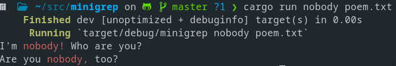

# Minigrep
Rust implementation of the classic command line tool `grep` in order to learn more about the language. Words that contain the matching query are highlighted in red.

## Run
Using `cargo`:

`cargo run <expression> <file_path>`

## Examples
Running: 

`cargo run nobody poem.txt`

Should have the following result:

